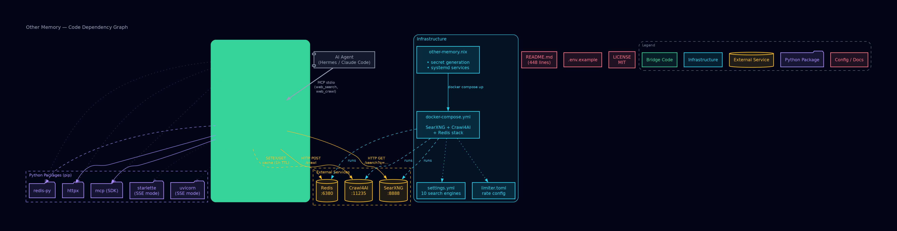

# Other Memory

> *"Memory never recaptures reality. Memory reconstructs."* — Frank Herbert, *Dune*

**Self-hosted search and crawl intelligence for AI agents. Zero API costs. Zero rate limits. Works with Hermes Agent, Claude Code, Codex, and any MCP-compatible client.**

## Contents

1. [Inspiration](#inspiration)
2. [What It Does](#what-it-does)
3. [Architecture](#architecture)
4. [Quick Start](#quick-start)
5. [NixOS Deployment](#nixos-deployment)
6. [MCP Tools Reference](#mcp-tools-reference)
7. [Configuration Reference](#configuration-reference)
8. [Security](#security)
9. [Directory Structure](#directory-structure)
10. [Production Notes](#production-notes)
11. [Upgrading](#upgrading)
12. [Troubleshooting](#troubleshooting)
13. [Acknowledgments](#acknowledgments)
14. [License](#license)

---

## Inspiration

This project was born from a [Reddit comment](https://www.reddit.com/r/hermesagent/comments/1ti2s9u/comment/omrw01p/?context=3) by u/Difficult_Hand_509 on r/hermesagent:

> *"For searching I suggest you use Searxng self hosted. You also want to use Crawl4ai. Point Hermes to both their full documentation and have it implement a search and crawl version of web search. They are great complement of each other. If you have Claude code ask Claude to do it for you as a connected mcp. You'll need a self hosted mcp server check out MetaMCP. It will work a lot better than firecrawl and tavily and never pay a penny for search and web crawling."*

If you've ever wondered whether you can replace Firecrawl + Tavily with something self-hosted, free, and better: **yes, you can**. This is the blueprint.

---

## What It Does

Other Memory exposes two MCP tools any AI agent can call:

| Tool | Backend | What It Does |
|------|---------|--------------|
| `web_search` | [SearXNG](https://github.com/searxng/searxng) | Meta search across Google, Bing, DuckDuckGo, Brave, Mojeek, Qwant, Startpage, GitHub, Wikipedia |
| `web_crawl` | [Crawl4AI](https://github.com/unclecode/crawl4ai) | JavaScript-rendered page extraction via headless browser. Returns clean markdown, plain text, or raw HTML |

Both tools are cached through Redis (1-hour TTL), deduplicated, rate-limited, and SSRF-protected. All zero-cost, zero-key, running entirely on your own metal.

---

## Architecture

```
┌──────────────────┐     MCP stdio      ┌──────────────────────┐
│  Hermes Agent    │ ──────────────────→│   MetaMCP Bridge     │
│  (or any MCP     │                    │   (Python, async)    │
│   client)        │                    │                      │
└──────────────────┘                    │  web_search()  ──────┤
                                        │  web_crawl()   ──────┤
                                        └──────┬─────────┬─────┘
                                               │         │
                                    ┌──────────▼──┐  ┌───▼──────────┐
                                    │   SearXNG    │  │  Crawl4AI    │
                                    │   :8888      │  │  :11235      │
                                    │              │  │              │
                                    │ Google, Bing,│  │ Headless     │
                                    │ DDG, Brave,  │  │ browser      │
                                    │ GitHub, WP…  │  │ (Playwright) │
                                    └──────┬───────┘  └──────────────┘
                                           │
                                    ┌──────▼───────┐
                                    │    Redis      │
                                    │    :6380      │
                                    │  (cache, 1h)  │
                                    └──────────────┘
```

**The bridge (MetaMCP)** is a single Python file, `metamcp/server.py`, that translates the MCP protocol to SearXNG and Crawl4AI HTTP APIs. It handles:

- **Caching**: SHA-256 keyed Redis cache with 1-hour TTL. Repeated queries hit cache, not upstream engines.
- **Deduplication**: Multiple engines may return the same URL; results are deduplicated by URL before being returned.
- **Graceful degradation**: If Redis is down, the bridge keeps working (just without caching). If SearXNG is down, it returns a clear error, not a crash.
- **SSRF protection**: Blocks internal IPs (10.x, 172.16-31.x, 192.168.x), metadata endpoints (169.254.169.254), and non-HTTP schemes.
- **Token budget awareness**: Crawl output is truncated at 50K characters with a midpoint cut (keeps the beginning and end, drops the middle) to stay within LLM context windows.

### Code Dependency Graph

Generated by [codebase-memory-mcp](https://github.com/DeusData/codebase-memory-mcp). 115 nodes, 197 edges. Indexed in 781ms.



> *Click the image for full resolution (4719×1218px). Also available as [SVG](code-graph.svg), [HTML](code-graph.html), and [DOT source](code-graph.dot).*

---

## Quick Start

### Prerequisites

- Docker and Docker Compose
- Python 3.10+ (for the MCP bridge)
- Hermes Agent, Claude Code, or any MCP-compatible client

### 1. Clone

```bash
git clone https://github.com/vanmanhacks/other-memory.git
cd other-memory
```

### 2. Generate secrets

```bash
cp .env.example .env && chmod 600 .env
openssl rand -hex 32  # → paste into SEARXNG_SECRET in .env
openssl rand -hex 16  # → paste into CRAWL4AI_TOKEN in .env
```

### 3. Create docker secret files

```bash
grep SEARXNG_SECRET .env | cut -d= -f2 > searxng_secret && chmod 600 searxng_secret
grep CRAWL4AI_TOKEN .env | cut -d= -f2 > crawl4ai_token && chmod 600 crawl4ai_token
```

### 4. Start the stack

```bash
docker compose up -d
```

Verify everything is healthy:

```bash
docker compose ps            # All three services should show "healthy"
curl -s 'http://localhost:8888/search?format=json&q=test' | jq '.results | length'
curl -s http://localhost:11235/health
docker compose exec redis redis-cli -p 6379 PING
```

### 5. Register with Hermes Agent

```bash
hermes mcp add other-memory --command /path/to/other-memory/metamcp/run.sh
```

Restart your Hermes session. The `web_search` and `web_crawl` tools will now appear in your agent's toolset.

**For Claude Code:**

```bash
# Add to your Claude Code MCP config:
claude mcp add other-memory --command /path/to/other-memory/metamcp/run.sh
```

**For any generic MCP client (SSE transport):**

```bash
python3 -m metamcp.server --sse 8765
# Connect your client to http://localhost:8765/mcp
```

---

## NixOS Deployment

Included is `other-memory.nix`, a NixOS module that manages the entire stack as systemd services.

### Systemd Architecture

```
other-memory-secret.service         (oneshot; generates secrets at boot)
         │
         ▼
other-memory-stack.service          (oneshot; docker compose up/down)
```

### Integration

```nix
# In your flake.nix or configuration.nix:
imports = [ /path/to/other-memory/other-memory.nix ];
```

**What it does:**

| Service | Purpose |
|---------|---------|
| `other-memory-secret` | Generates `/etc/other-memory/searxng_secret`, `/etc/other-memory/crawl4ai_token`, and `/etc/other-memory/env` on first boot. Idempotent; never overwrites existing secrets. |
| `other-memory-stack` | Runs `docker compose up -d` / `docker compose down`. Requires Docker and `other-memory-secret`. Remains after exit (`RemainAfterExit=true`) so the stack stays running. |

**Secrets live at:** `/etc/other-memory/` (root-owned directory, 600 files). The env file is automatically populated with `SEARXNG_SECRET` and `CRAWL4AI_TOKEN`.

**On non-NixOS systems:** use the `.env` file approach. Same variables, same effect.

---

## MCP Tools Reference

### `web_search`

Search the web through ten upstream engines.

| Parameter | Type | Required | Default | Description |
|-----------|------|----------|---------|-------------|
| `query` | string | ✅ | N/A | Search query. Use technical terms, CVE IDs, package names. |
| `num_results` | integer | N/A | 10 | Results to return (1–20). |
| `language` | string | N/A | `en` | Language code: `en`, `de`, `fr`, `ja`, `zh`… |
| `categories` | array | N/A | `["general"]` | One or more: `general`, `news`, `science`, `files`, `images`, `social_media`. |

**Response fields:**

```jsonc
{
  "query": "searxng docker setup",
  "total_results_raw": 47,           // Before dedup
  "total_results_deduped": 31,       // After URL dedup
  "results": [
    {
      "title": "SearXNG Documentation",
      "url": "https://docs.searxng.org/",
      "snippet": "SearXNG is a free internet metasearch engine…",
      "engines": ["google", "duckduckgo", "bing"]  // Which engines found this
    }
  ],
  "engines_queried": ["bing", "brave", "duckduckgo", …],
  "query_time_ms": 847,
  "cached": false,                   // true = returned from Redis cache
  "timestamp": "2026-06-29T22:12:41.417141+00:00"
}
```

**Note:** SafeSearch is intentionally set to `0` (disabled). This is the correct default for security research: CVEs, exploit PoCs, and offensive security tools are often flagged by content filters. If you need filtered results for general use, modify `safesearch` in `metamcp/server.py` line 244.

### `web_crawl`

Extract content from any URL with full JavaScript rendering.

| Parameter | Type | Required | Default | Description |
|-----------|------|----------|---------|-------------|
| `url` | string | ✅ | N/A | Full URL including `https://`. |
| `render_js` | boolean | N/A | `true` | Execute JavaScript before extraction. Required for React/Vue/Angular. Set `false` for static HTML (faster). |
| `extract_mode` | string | N/A | `markdown` | Output format: `markdown`, `text`, or `html`. |

**Response fields:**

```jsonc
{
  "url": "https://example.com",
  "title": "Example Domain",
  "content": "# Example Domain\n\nThis domain is for…",  // Markdown/Text/HTML
  "content_length": 425,
  "original_length": 425,            // Pre-truncation length
  "truncated": false,                // true if content exceeded 50K chars
  "links_found": 12,                 // Count of discovered URLs
  "rendered": true,                  // Whether JS was executed
  "extract_mode": "markdown",
  "crawl_time_ms": 2341,
  "cached": false,
  "timestamp": "2026-06-29T22:12:43.518000+00:00"
}
```

**Security:** The bridge blocks internal IPs, metadata endpoints (AWS/GCP/Azure), and non-HTTP schemes. This is not a vulnerability scanner; it refuses to crawl `localhost`, `169.254.169.254`, `file://`, etc.

---

## Configuration Reference

### Environment Variables

| Variable | Required | Generated By | Description |
|----------|----------|-------------|-------------|
| `SEARXNG_SECRET` | Yes | `openssl rand -hex 32` | 32-byte hex secret for SearXNG sessions/CSRF. |
| `CRAWL4AI_TOKEN` | Yes | `openssl rand -hex 16` | Internal API token for Crawl4AI (localhost only). |

### Docker Compose Services

| Service | Image | Port | Memory | Purpose |
|---------|-------|------|--------|---------|
| SearXNG | `searxng/searxng:2026.6.4` | `127.0.0.1:8888` | ~200 MB | Meta search engine |
| Crawl4AI | `unclecode/crawl4ai:0.8.9` | `127.0.0.1:11235` | 2 GB | JS-rendered crawler |
| Redis | `redis:7-alpine` | `127.0.0.1:6380` | 256 MB | Query cache (LRU eviction) |

All services bind to `127.0.0.1`; nothing is exposed to the network. The MCP bridge communicates over localhost, so your search traffic stays private.

### Port Map

| Port | Service | Conflict Check |
|------|---------|----------------|
| `8888` | SearXNG | None (if you run GHOLA: GHOLA doesn't use this) |
| `11235` | Crawl4AI | None |
| `6380` | Redis | Separate from GHOLA Redis (`6379`) |

### SearXNG Settings

The SearXNG configuration at `searxng/settings.yml` enables ten upstream search engines:

**General:** Google, DuckDuckGo, Bing, Brave, Mojeek, Qwant, Startpage
**News:** Google News
**Code/Tech:** GitHub, Wikipedia

Engines are queried in parallel. Response time is the slowest responding engine (800ms–2s). SearXNG uses rotating user agents and connection pooling for upstream reliability.

The rate limiter (`searxng/limiter.toml`) allows unlimited requests from localhost and the Docker bridge network. Actual rate limiting is handled upstream by each search engine; SearXNG itself imposes minimal overhead.

### Redis Cache

- **Key format:** `om:search:<sha256-truncated>` or `om:crawl:<sha256-truncated>`
- **TTL:** 1 hour (3600 seconds)
- **Eviction:** `allkeys-lru`; old entries evicted when 256 MB is reached
- **Persistence:** AOF (append-only file); cache survives restarts
- **Graceful degradation:** If Redis is unreachable, the bridge operates without caching (no errors, no crashes)

---

## Security

### What's Protected

- **No API keys required.** None. You never provision a Firecrawl API key, Tavily key, Serper key, or Brave Search API key. SearXNG queries upstream engines the same way a browser would, using rotating user agents from a list of common desktop browsers.
- **All services bind to localhost only** (`127.0.0.1`). Nothing is exposed to your network or the internet.
- **SSRF protection** in the MCP bridge blocks internal IP ranges, metadata endpoints, and non-HTTP URL schemes. An agent cannot trick the crawler into probing your internal network.
- **Rate limiting** at the SearXNG level: 30 requests/minute to upstream engines (configurable in `limiter.toml`).
- **Redis cache** amortizes repeated queries; the same search term within an hour hits cache, not Google.
- **Secrets** are generated with `openssl rand -hex` and stored in Docker secrets (`searxng_secret`, `crawl4ai_token`) or `/etc/other-memory/` on NixOS.

### What's Not Protected (by Design)

- **No authentication on SearXNG or Crawl4AI.** They bind to localhost only. If an attacker has localhost access, you have bigger problems.
- **No TLS between services.** Same-host communication over localhost doesn't benefit from TLS.
- **No audit logging.** This is a utility bridge, not a SIEM. Hermes Agent logs tool calls; SearXNG has its own access logging.

---

## Directory Structure

```
other-memory/
├── README.md                     # You are here
├── LICENSE                       # MIT
├── .env.example                  # Environment template
├── .gitignore                    # Secrets, volumes, internal docs
├── docker-compose.yml            # Three-service stack (pinned images)
├── other-memory.nix              # NixOS systemd module
├── metamcp/
│   ├── __init__.py               # Package init, version 0.1.0
│   ├── server.py                 # MCP bridge, the whole thing (521 lines)
│   ├── run.sh                    # Launcher script
│   └── requirements.txt          # mcp, httpx, redis
└── searxng/
    ├── settings.yml              # Ten search engines, JSON API
    └── limiter.toml              # Trust localhost/Docker bridge
```

**The bridge is ~500 lines of Python.** No framework. No ORM. No config files beyond environment variables. It does two things: search and crawl.

---

## Production Notes

This stack has been running 24/7 on a Hetzner VPS (4 GB RAM, 2 vCPUs) alongside GHOLA (an offensive security framework) and other services. Observed performance:

- **SearXNG memory:** ~200 MB steady state
- **Crawl4AI memory:** 300–600 MB (with Playwright headless browser; spikes during concurrent crawls)
- **Redis memory:** ~50 MB typical (256 MB cap)
- **Total stack footprint:** ~1 GB RAM
- **Search latency:** 800ms–2s (parallel upstream query, median ~1.2s)
- **Crawl latency:** 1s–8s (JS rendering dominates; static pages are fast)

The `restart: unless-stopped` policy on all containers handles Docker daemon restarts. Health checks run every 30–60 seconds.

---

## Upgrading

Images are pinned to specific versions in `docker-compose.yml` for reproducible deployments. To upgrade:

```bash
# 1. Check for newer images
docker compose pull

# 2. Update the image hash in docker-compose.yml
docker compose images --format json | jq -r '.[] | "\(.Service): \(.Image)@\(.ID)"'

# 3. Re-deploy
docker compose up -d

# 4. Verify health
docker compose ps
```

**Before upgrading:** Crawl4AI changes its response format between minor versions. The bridge handles known format variations (v0.4–v0.8.x), but review the [Crawl4AI changelog](https://github.com/unclecode/crawl4ai/releases) before bumping major versions. SearXNG upgrades are safe; the JSON API is stable.

---

## Troubleshooting

### SearXNG returns empty results

```bash
docker compose logs searxng | tail -20
```

Common causes:
- Upstream engines rate-limiting your IP (rare; rotating user agents mitigate this)
- `SEARXNG_SECRET` not set or mismatched between `.env` and `searxng_secret` file
- DNS issues on the host

### Crawl4AI times out

```bash
docker compose logs crawl4ai | tail -20
```

Crawl4AI has a 60-second timeout. Large pages or slow JavaScript-heavy sites may time out. The bridge returns a clear error: `"Crawl4ai timed out after 60s"`. Increase the timeout in `server.py` line 366 if needed.

### Redis connection refused

```bash
docker compose exec redis redis-cli -p 6379 PING
```

If Redis is down, the bridge logs a warning and continues without caching. Fix: `docker compose restart redis`.

### "MCP server not found" in Hermes

```bash
hermes mcp list
```

Verify the path in your `hermes mcp add` command is absolute and the `run.sh` is executable:

```bash
chmod +x /path/to/other-memory/metamcp/run.sh
hermes mcp add other-memory --command /path/to/other-memory/metamcp/run.sh
```

---

## Acknowledgments

- **u/Difficult_Hand_509**: for the Reddit comment that started it all. Sometimes the best projects come from a stranger saying "you could just self-host this."
- **[SearXNG](https://github.com/searxng/searxng)**: privacy-respecting meta search engine. The backbone of the free web search layer.
- **[Crawl4AI](https://github.com/unclecode/crawl4ai)**: open-source, LLM-friendly web crawler. Handles the JavaScript-rendered web that simple `curl` can't touch.
- **[Anthropic MCP SDK](https://github.com/modelcontextprotocol/python-sdk)**: the protocol that makes it possible to wire arbitrary tools into AI agents.
- **[Hermes Agent](https://hermes-agent.nousresearch.com)**: the always-on agent that made this whole thing worth building.
- **Claude Code**: wrote the first draft of `server.py` in a single afternoon session. The 521-line file you see now has been iterated and battle-tested since, but the architecture is what emerged from that initial conversation.

---

## License

MIT. See [LICENSE](LICENSE).

Build your own memory. The desert provides.
